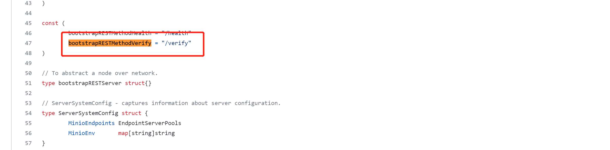
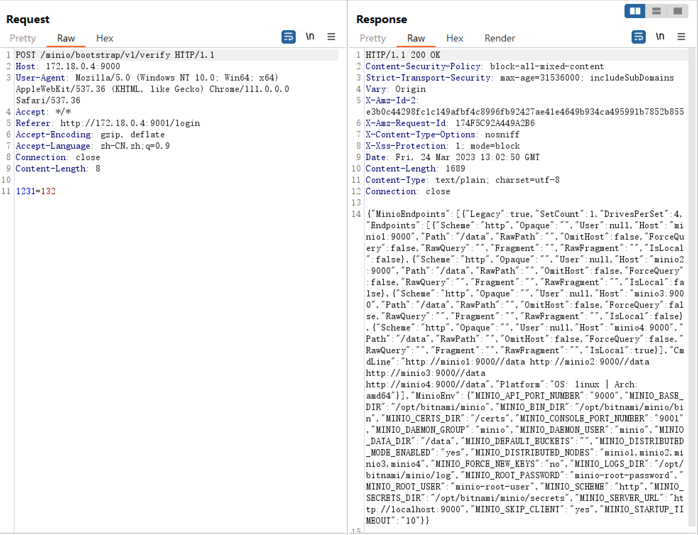

# CVE-2023-28432 MinIO敏感信息泄露漏洞


## 前言

MinIO 提供高性能、与S3 兼容的对象存储系统，让用户自己能够构建自己的云储存服务。MinIO原生支持 Kubernetes，它可用于每个独立的公共云、每个 Kubernetes 发行版、私有云和边缘的对象存储套件。

3月20日，MinIO 官方发布了安全补丁，修复了一处敏感信息泄露漏洞 CVE-2023-28432


官方更新：https://github.com/minio/minio/security/advisories/GHSA-6xvq-wj2x-3h3q

## 漏洞详情

### 1. 介绍

补丁

```
commit 3b5dbf90468b874e99253d241d16d175c2454077
Author: Harshavardhana <harsha@minio.io>
Date:   Mon Mar 20 01:40:24 2023 -0700

    allow bootstrapping to validate internode tokens (#16853)
```

The vulnerable code:

```
// minio/cmd/bootstrap-peer-server.go
func (b *bootstrapRESTServer) VerifyHandler(w http.ResponseWriter, r *http.Request) {
  ctx := newContext(r, w, "VerifyHandler")
  cfg := getServerSystemCfg()
  logger.LogIf(ctx, json.NewEncoder(w).Encode(&cfg))
}

// minio/cmd/bootstrap-peer-server.go
func getServerSystemCfg() ServerSystemConfig {
  envs := env.List("MINIO_")
  envValues := make(map[string]string, len(envs))
  for _, envK := range envs {
    // skip certain environment variables as part
    // of the whitelist and could be configured
    // differently on each nodes, update skipEnvs()
    // map if there are such environment values
    if _, ok := skipEnvs[envK]; ok {
      continue
    }
    envValues[envK] = env.Get(envK, "")
  }
  return ServerSystemConfig{
    MinioEndpoints: globalEndpoints,
    MinioEnv:       envValues,
  }
}
```


### 2. 影响范围

MinIO RELEASE.2019-12-17T23-16-33Z <= MinIO Version < MinIO RELEASE.2023-03-20T20-16-18Z

## 漏洞分析

根据漏洞公告与github上的说明，漏洞属于在集群部署的情况下的信息泄露，MinIO会返回所有的环境变量，包括`MINIO_SECRET_KEY` 和`MINIO_ROOT_PASSWORD`,因此漏洞点在于集群部署场景下向Minio服务器发送请求，可以获取MinIO的敏感信息。

查看commit:https://github.com/minio/minio/pull/16853/files

发现有两个文件做了修改，主要是cmd/bootstrap-peer-server.go这个文件

skipEnvs中添加了MINIO_ROOT_PASSWORD、MINIO_ACCESS_KEY、MINIO_SECRET_KEY等关键字，关键点就在这，应该是有其他用户可以发送请求到MinIO服务器，服务器会返回环境变量，这次的commit是把环境变量中的敏感信息给加到黑名单了。

返回信息代码如下：

```golang
func (b *bootstrapRESTServer) HealthHandler(w http.ResponseWriter, r *http.Request) {}

func (b *bootstrapRESTServer) VerifyHandler(w http.ResponseWriter, r *http.Request) {
	ctx := newContext(r, w, "VerifyHandler")

	if err := storageServerRequestValidate(r); err != nil {
		b.writeErrorResponse(w, err)
		return
	}

	cfg := getServerSystemCfg()
	logger.LogIf(ctx, json.NewEncoder(w).Encode(&cfg))
}
```

在/verify下会返回信息，无需验证



通过docker-compose搭建环境，docker-compose.yml文件如下：

```yaml
version: '2'

services:
  minio1:
    image: 'bitnami/minio:2023.3.13'
    environment:
      - MINIO_ROOT_USER=minio-root-user
      - MINIO_ROOT_PASSWORD=minio-root-password
      - MINIO_DISTRIBUTED_MODE_ENABLED=yes
      - MINIO_DISTRIBUTED_NODES=minio1,minio2,minio3,minio4
      - MINIO_SKIP_CLIENT=yes
  minio2:
    image: 'bitnami/minio:2023.3.13'
    environment:
      - MINIO_ROOT_USER=minio-root-user
      - MINIO_ROOT_PASSWORD=minio-root-password
      - MINIO_DISTRIBUTED_MODE_ENABLED=yes
      - MINIO_DISTRIBUTED_NODES=minio1,minio2,minio3,minio4
      - MINIO_SKIP_CLIENT=yes
  minio3:
    image: 'bitnami/minio:2023.3.13'
    environment:
      - MINIO_ROOT_USER=minio-root-user
      - MINIO_ROOT_PASSWORD=minio-root-password
      - MINIO_DISTRIBUTED_MODE_ENABLED=yes
      - MINIO_DISTRIBUTED_NODES=minio1,minio2,minio3,minio4
      - MINIO_SKIP_CLIENT=yes
  minio4:
    image: 'bitnami/minio:2023.3.13'
    environment:
      - MINIO_ROOT_USER=minio-root-user
      - MINIO_ROOT_PASSWORD=minio-root-password
      - MINIO_DISTRIBUTED_MODE_ENABLED=yes
      - MINIO_DISTRIBUTED_NODES=minio1,minio2,minio3,minio4
      - MINIO_SKIP_CLIENT=yes
```


根据代码分析可以知道路由为http://<minio-server>:9000/<bucket-name>/bootstrap/v1/verify

这个<bucket-name>可以用minio的默认桶，桶名就是minio

一开始我以为是需要自己创建一个公开桶，但是这个漏洞传的比较广，说明利用条件并不苛刻，所以应该是用了默认的配置就可以攻击




### RCE分析

commit：https://github.com/minio/minio/pull/16857 用户可以触发升级到由他们控制的二进制文件。

网上说可以通过这个漏洞RCE，猜测是通过泄露的密码登录后找到某个操作从而RCE的，公众号文章今天也出来了，与猜测的一致，是通过账户密码登录mc（MinIO客户端）进行升级，升级包可控，官方没有校验，导致了RCE。


经过研究发现，当执行升级命令后

```
mc admin update myminio -y
```

默认会从官方服务器获取最新版本，相关代码中的定义如下：

```
// minio/cmd/update.go
const (
    minioReleaseTagTimeLayout = "2006-01-02T15-04-05Z"
    minioOSARCH               = runtime.GOOS + "-" + runtime.GOARCH
    minioReleaseURL           = "https://dl.min.io/server/minio/release/" + minioOSARCH + SlashSeparator

    envMinisignPubKey = "MINIO_UPDATE_MINISIGN_PUBKEY"
    updateTimeout     = 10 * time.Second
)
```

通过跟进代码的相关逻辑可以发现，可以直接拉取一个二进制文件，然后实现自我更新，相关简化流程如下：

验证管理员权限→获取最新版本→获取最新版本的sha256sum信息→下载并验证sha256sum→验证无误后替换自身并重启

虽然sha256我们不可控，但是用于验证的sha256sum文件是我们可控的。

https://github.com/minio/minio/pull/16857/commits/4d4cc50dd6656512dee483492aa0a241babd35c4

跟进相关代码可以发现，envMinisignPubKe默认为空，导致签名校验失效，所以我们可以构造恶意升级包，最终形成RCE。
